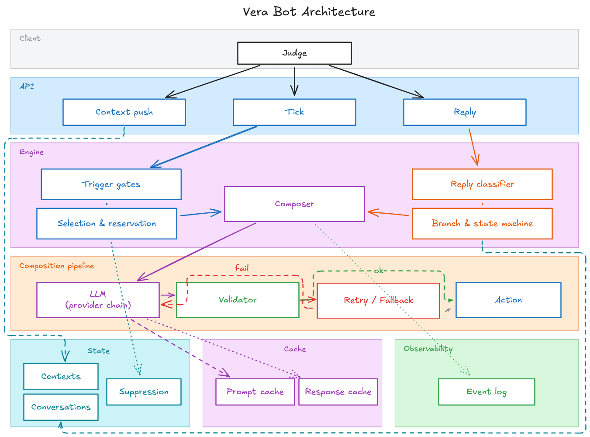

# Vera Bot — magicpin AI Challenge

A merchant + customer-on-behalf AI assistant on WhatsApp. One composition engine drives both the static `submission.jsonl` and the live HTTPS bot.

**Self-graded score:** 43/50 (86%) on the live judge `full_evaluation` scenario; 41.2/50 on the 10-pair holdout (no overfit).

## Solution Architecture



The system is one composition engine wrapped by two presentations — a synchronous `compose()` for the static `submission.jsonl` and an async `acompose()` for the live HTTPS bot. Reading the diagram top-to-bottom:

**Client → API.** The judge talks to three meaningful endpoints: a context push (idempotent upserts of categories / merchants / customers / triggers, versioned 200/409), a tick poll (proactive sends), and a reply webhook (reactive sends). Two utility endpoints (healthz, metadata) and an optional teardown round out the surface.

**Engine — two paths converge on one composer.** The proactive path runs incoming triggers through a 7-gate filter (resolution, staleness, suppression, active-conversation, cooldown with urgency≥4 bypass, daily cap, customer consent), then a selection step that caps emissions to 1/merchant and 3/tick and reserves keys before composing. The reactive path classifies the merchant's reply (regex prefilters first, classifier fallback only when prefilters disagree) and routes through a 9-row branch table into a 5-state conversation FSM. Both paths feed into the same composer, which picks one of two skeleton prompts (merchant-facing or customer-facing) and a 31-entry playbook keyed on `trigger.kind`.

**Composition pipeline.** The composer hands a structured prompt to the LLM provider chain (Anthropic Sonnet → OpenAI gpt-4o → Gemini, all selectable at runtime), then runs the JSON output through a 6-rule deterministic validator: structural shape, anchor verifiability with numeric-equivalence tolerance (`-50%` ↔ `-0.5`), vocab taboo, language fit, anti-repetition, and send-as integrity. On pass the action goes out. On fail the validator's error list is fed back as a single retry; a second failure produces a deterministic per-kind safe fallback rather than an empty body.

**State, cache, observability.** State is in-memory (judge runs start clean per spec): a Context store for pushed contexts, a Conversation store driving the reply FSM with `phase_transition` events, and a Suppression store holding sent-keys plus in-flight reservations that prevent double-emit under overlapping ticks. The cache layer is two-tier — Anthropic prompt-cache (two ephemeral breakpoints on the stable skeleton + category blocks, ~90% read-discount within 5-min TTL) and a local response-cache keyed on prompt-version + model + context hashes for byte-identical reruns. Every significant event (compose, tick_skip, validator_fail, fallback_used, cache_hit, phase_transition) lands in `logs/run_{RUN_ID}.jsonl` for post-run forensics.

## Tradeoffs

The bot optimizes cost-per-score, not maximum model spend: Sonnet is used for composition, Haiku for cheap classification, OpenAI is the single fallback hop, and Gemini is the third selectable option. The default LLM call timeout is short enough to leave room for fallback inside the judge's 30s budget.

The validator is intentionally strict on fabricated anchors because one invented citation costs -2 in the rubric. Numeric anchors are equivalence-tolerant (a body that says "30%" against context `0.30` is not a fabrication), but everything else is literal-substring. If validation fails twice, the bot emits a deterministic safe fallback rather than timing out or returning malformed JSON. That protects operations, but fallback quality is lower than live LLM output.

The `customer_lapsed_hard` playbook is heavily shape-constrained (≤240 chars, single binary CTA, no-shame tone, required facts in priority order) — a deliberate choice over the simpler "let the model freelance" approach, because hard-lapsed customer winbacks score very differently when the LLM picks guilt-tripping copy. We preserved authorship in the LLM rather than hardcoding a template post-compose.

## What additional context would have helped most

Real merchant offer source-of-truth would let the composer choose the strongest service-at-price hook instead of relying on synthetic catalog entries.

Fresh customer aggregates and per-customer consent ledgers would make customer-facing sends safer and more specific. The current `customer.consent.scope` defaults to `["promotional_offers"]` for most rows, which forces the consent gate to be conservative.

Peer stats by city × locality (rather than `metro_solo_practices`) would lift Merchant-Fit scoring on perf-related triggers — anchoring on "your CTR is 2.1% vs 3.0% peer median in Lajpat Nagar specifically" reads stronger than the current metro-level comparison.

---

## Run

```bash
# Install deps
uv sync

# Configure (.env)
# Fill in at least ONE provider's API key, then pick the chain:
#   LLM_PROVIDER          = anthropic | openai | gemini      (default: anthropic)
#   LLM_FALLBACK_PROVIDER = anthropic | openai | gemini | none (default: openai)
#   JUDGE_LLM_PROVIDER    = (same set, +deepseek/groq/openrouter/ollama)
#   JUDGE_LLM_MODEL       = (provider-specific; defaults to that provider's strongest stable model)

# Local server
uvicorn server:app --host 0.0.0.0 --port 8080

# Or via Docker
docker build -t vera-bot . && docker run -p 8080:8080 --env-file .env vera-bot

# Generate the static submission.jsonl (30 pairs)
python make_submission.py --all

# Holdout overfit check (10 unseen pairs, scored by the judge LLM)
python make_submission.py --holdout --score

# Self-grade against the live local bot
python scripts/run_judge.py full_evaluation

# Deterministic tests (no LLM keys needed)
python scripts/test_validator.py        # 10/10 validator unit tests
python scripts/test_classifiers.py      # 30/30 reply-classifier cases
python scripts/test_state_policy.py     # state-store + tick gate invariants
python scripts/test_tick_reservations.py # concurrency: no double-emit under overlap
python scripts/smoke_integration.py     # full E2E via FastAPI TestClient
```

## Layout

```
bot.py                      compose() + acompose() + handle_reply() + classify_reply()
server.py                   FastAPI shell — 5 /v1/* endpoints + /v1/teardown
state.py                    ContextStore + ConversationStore + SuppressionStore
llm_client.py               Anthropic + OpenAI + Gemini chain, prompt cache + response cache
validator.py                6-rule validator + numeric-anchor equivalence + per-kind safe fallbacks
classifiers.py              Reply classifier (regex prefilters + Haiku/Flash fallback)
obs.py                      Structured JSONL event logging (logs/run_{RUN_ID}.jsonl)
make_submission.py          Batch JSONL generator (--pair / --all-merchant / --all / --holdout --score)
prompts/
  __init__.py               PROMPT_VERSION (currently v8)
  skeletons.py              MERCHANT_FACING_SYSTEM + CUSTOMER_FACING_SYSTEM
  playbooks.py              31-entry per-trigger-kind map + ACTION_MODE / QA_MODE
  templates.py              Templated reply messages for the no-LLM branches
dataset/
  categories/, merchants/, customers/, triggers/   per-file JSONs (full set)
  *_seed.json               seed subset used by judge_simulator.DatasetLoader
  test_pairs.json           30 hand-picked test pairs
  holdout_pairs.json        10-pair overfit-detection holdout
scripts/
  smoke_llm.py              live compose+classify smoke (--openai-only / --gemini-only)
  smoke_integration.py      E2E via FastAPI TestClient (no API keys needed)
  compose_one.py            drive bot.acompose() on one test pair
  test_validator.py / test_classifiers.py / test_state_policy.py / test_tick_reservations.py
  run_judge.py              wrapper around bundled judge_simulator.py
  judge_provider_overrides.py  patches the bundled judge (Gemini adapter + scoring prompt + env config)
Dockerfile / .dockerignore  production container (non-root, healthcheck)
fly.toml                    backup deploy config (fly.io Mumbai region)
design-decisions.md         locked decisions Q1-Q12 from the grill-me interview
IMPLEMENTATION-PLAN.md      21 vertical slices with checkboxes (current state: 19/21 done)
```
